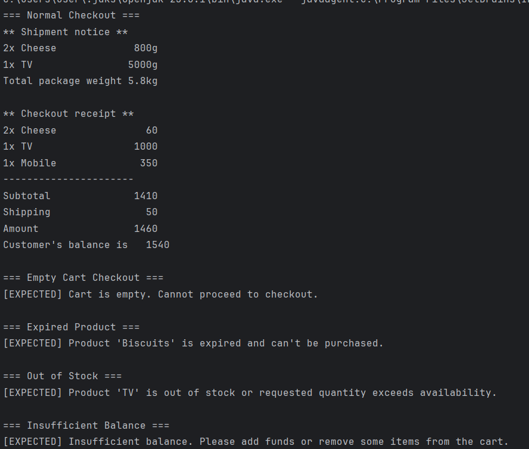
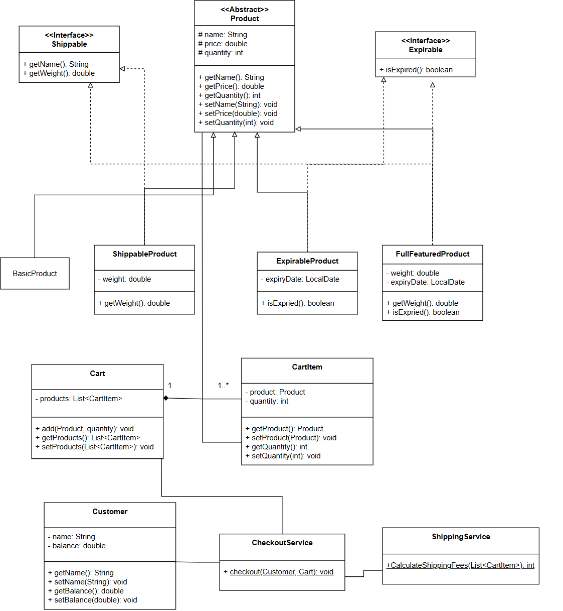

# 🛒 E-Commerce System

This project simulates a simple console-based e-commerce system written in Java. It models real-world product types, customer behavior, and business rules like product expiry, shipping, and purchase limitations.

---
## Screenshot from a running app

---

## 📦 Features

- Abstract product hierarchy with multiple behaviors:
    - Shipable products (require shipping weight)
    - Expirable products (have expiration dates)
- Cart and customer system for adding and purchasing products
- Custom exceptions for clean error handling
- Shipping service that collects all shippable items
- Console-based checkout summary with subtotal, shipping, and remaining balance

---
## 📊 Class Diagram


---
## 📂 Project Structure
- `model/`
    - `product/`
        - `Product.java`
        - `FullFeaturedProduct.java`
        - `ShipableProduct.java`
        - `ExpirableProduct.java`
        - `BasicProduct.java`
        - `interfaces/`
            - `Shipable.java`
            - `Expirable.java`
    - `customer/`
        - `Customer.java`
    - `cart/`
        - `Cart.java`
        - `CartItem.java`
- `service/`
    - `CheckoutService.java`
    - `ShippingService.java`
- `exception/`
    - `OutOfStockException.java`
    - `EmptyCartException.java`
    - `ExpiredException.java`
    - `InsufficientBalanceException.java`
- `Main.java`

---
## ✅ Demo Scenarios (in Main.java)

`Main.java` demonstrates key use cases with 5 different customers:

1. **Successful checkout**
    - Adds valid items
    - Includes shipping and expiry handling
    - Prints subtotal, shipping fee, and final balance

2. **Empty cart**
    - Checkout fails with `EmptyCartException`

3. **Expired product**
    - Adding an expired product triggers `ExpiredException`

4. **Out of stock**
    - Adding more than available quantity throws `OutOfStockException`

5. **Insufficient balance**
    - Customer with low balance fails to checkout (`InsufficientBalanceException`)
---
## 🛠 How to Run

1. Clone the repository and open it in IntelliJ IDEA (or any Java IDE):
   ```bash
   git clone https://github.com/OmarAbdelmonemSayed/e-commerce-system-Fawry-Internship.git
